<p align="center">
  
  
  
  
  
  
</p>

<h1 align="center">DeepThinkingFlow-AI</h1>

<p align="center">
  <strong>Runtime-Steering and SFT-Seed Stack for Structured Reasoning</strong><br/>
  <em>Bilingual (Vietnamese/English) | LoRA/QLoRA Fine-Tuning | Behavior Bundles | Skill Compliance | Heuristic Eval</em>
</p>

<p align="center">
  A self-built, end-to-end local AI reasoning pipeline -- an independent AI system with its own Mixture-of-Experts architecture.<br/>
  Focused on <strong>structured reasoning</strong>, <strong>bilingual behavior steering</strong>,
  <strong>adapter-based fine-tuning</strong>, and <strong>honest compliance boundaries</strong>.
</p>

---

## Table of Contents

- [Overview](#overview)
- [Architecture](#architecture)
- [Project Structure](#project-structure)
- [Safetensors Tensor Map](#safetensors-tensor-map)
- [Prerequisites](#prerequisites)
- [Quick Start](#quick-start)
- [External Hosts](#external-hosts)
- [CLI Reference](#cli-reference)
- [Workflows](#workflows)
  - [Inference Workflow](#1-inference-workflow)
  - [Training Workflow](#2-training-workflow)
  - [Evaluation Workflow](#3-evaluation-workflow)
  - [Full Pipeline Workflow](#4-full-pipeline-end-to-end)
- [Behavior Bundle System](#behavior-bundle-system)
- [Model Profile](#model-profile)
- [Training Configuration](#training-configuration)
- [Training Parameter Evolution](#training-parameter-evolution)
- [Testing](#testing)
- [Codex Skill Integration](#codex-skill-integration)
- [Dataset Statistics](#dataset-statistics)
- [Design Principles](#design-principles)
- [License](#license)

---

## Overview

DeepThinkingFlow is a separately built local AI project focused on structured reasoning, behavior steering, and adapter-based training around a custom open-weight runtime stack. It is designed as its own build, with a dedicated CLI, behavior bundle system, SFT/LoRA pipeline, safetensors inspection tooling, and verification flow instead of acting like a thin wrapper around a generic chat app.

DeepThinkingFlow includes:

| Component | Description |
|---|---|
| **Runtime Steering** | Controls model behavior through behavior bundles (system prompt + profile) **without modifying weights** |
| **SFT Seed Data** | Bilingual Vietnamese/English training dataset in "harmony" format for supervised fine-tuning |
| **Skill Compliance Data** | Dedicated dataset enforcing honest boundaries between runtime-only, training-ready, and learned behavior |
| **LoRA/QLoRA Training** | Complete adapter training pipeline with fixed train/eval splits, early stopping, gradient checkpointing |
| **Multi-turn Chat** | Interactive terminal chat with conversation history and dynamic reasoning effort switching |
| **Heuristic Evaluation** | Scores outputs against a trait checklist and rubric rules, including skill compliance traits |
| **Safetensors Inspector** | Header-only audit of the local weight file, validating tensor shapes against architecture config |
| **Artifact Reporter** | Hashes base weights, adapter outputs, eval files, and classifies the strongest supportable claim level |
| **Unified CLI** | Single entry point for all 19 scripts via `deepthinkingflow_cli.py` (16 commands) |

### Key Features

- **Bilingual (Vietnamese/English)** -- defaults to Vietnamese when the user writes in Vietnamese
- **Behavior Bundles** -- cleanly separates system prompt, profile, SFT data, skill compliance data, and eval cases
- **3 Reasoning Levels** -- `low`, `medium`, `high` -- switchable mid-session
- **Structured Output** -- Goal, Assumptions, Analysis, Answer, Examples, Checks
- **Skill Compliance Ladder** -- explicit separation of runtime-only, training-ready, and learned-only-after-training claims
- **No hidden chain-of-thought claims** -- only visible analysis when opted in
- **27/27 smoke tests passing** -- covers CLI, runtime helpers, chat flow, prompt rendering, one-shot generation, bundle validation, evaluator traits, training dry-run, asset builder, safetensors inspector, artifact reporter, env helpers

---

## Architecture

```mermaid
graph TB
    User["User Terminal"]

    subgraph CLI["CLI Layer"]
        CLIScript["deepthinkingflow_cli.py<br/><em>Unified launcher - 16 commands</em>"]
    end

    subgraph Scripts["Script Layer (19 scripts)"]
        Chat["chat_deepthinkingflow.py"]
        Run["run_transformers_deepthinkingflow.py"]
        Render["render_transformers_deepthinkingflow_prompt.py"]
        Compose["compose_behavior_request.py"]
        Validate["validate_behavior_bundle.py"]
        Bootstrap["bootstrap_transformers_deepthinkingflow.py"]
        Assemble["assemble_local_transformers_model_dir.py"]
        PrepSFT["prepare_harmony_sft_dataset.py"]
        PrepAssets["prepare_deepthinkingflow_training_assets.py"]
        Train["train_transformers_deepthinkingflow_lora.py"]
        Eval["evaluate_reasoning_outputs.py"]
        Inspect["inspect_safetensors_model.py"]
        GenSkill["generate_skill_compliance_corpus.py"]
        Report["report_deepthinkingflow_artifacts.py"]
        BootEnv["bootstrap_training_env.py"]
        CreateTiny["create_tiny_gpt_oss_smoke_model.py"]
        EnvHelper["deepthinkingflow_env.py"]
    end

    subgraph RuntimeCore["Runtime Core"]
        Runtime["deepthinkingflow_runtime.py<br/><em>Model Loader + Memory Check<br/>Prompt Renderer + Chat Template<br/>Response Extractor</em>"]
    end

    subgraph HF["HuggingFace Transformers"]
        Model["AutoModelForCausalLM"]
        Tokenizer["AutoTokenizer + chat_template"]
    end

    subgraph Data["Data Layer"]
        Bundle["Behavior Bundle<br/>(system_prompt + profile + datasets + evals)"]
        Weights["Model Weights<br/>(model.safetensors ~12.82 GiB)"]
        Adapters["LoRA Adapters<br/>(PEFT output)"]
    end

    User --> CLIScript
    CLIScript --> Chat & Run & Render & Compose & Validate & Bootstrap
    CLIScript --> Assemble & PrepSFT & PrepAssets & Train & Eval & Inspect
    CLIScript --> GenSkill & Report & BootEnv

    Chat --> Runtime
    Run --> Runtime
    Render --> Runtime

    Runtime --> Model & Tokenizer

    Model --> Weights & Adapters
    Tokenizer --> Bundle
```

### Inference Flow

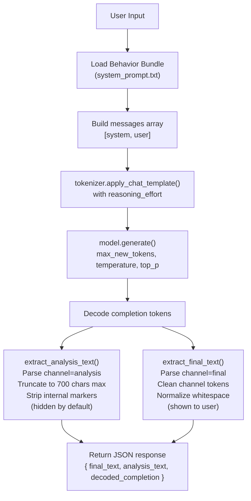

### Training Flow

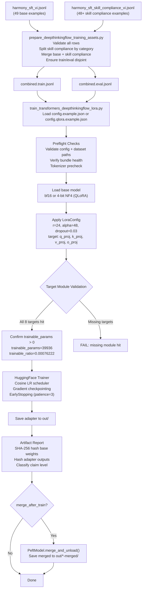

---

## Project Structure

```
deepthinkingflow/
├── README.md                                          # Project documentation
├── LICENSE                                            # GNU General Public License v3
├── .gitignore                                         # Ignores weights and training outputs
├── requirements-transformers.txt                      # Dependencies for inference
├── requirements-train-dtf.txt                         # Dependencies for training
│
├── behavior/
│   └── DeepThinkingFlow/
│       ├── profile.json                               # Bundle metadata, quality gates, compliance model
│       ├── system_prompt.txt                          # System prompt with tagged blocks
│       ├── evals/
│       │   ├── reasoning_following.jsonl              # 20+ reasoning eval cases with traits and rubrics
│       │   └── skill_compliance_following.jsonl       # 24 skill compliance eval cases
│       └── training/
│           ├── sft_reasoning_vi.jsonl                 # 6+ original SFT seed examples (vi)
│           ├── harmony_sft_vi.jsonl                   # 49 harmony-format base examples (vi)
│           ├── harmony_sft_vi.train.jsonl             # 39 base train split (seed=42)
│           ├── harmony_sft_vi.eval.jsonl              # 10 base eval split (seed=42)
│           ├── harmony_sft_skill_compliance_vi.jsonl  # 48+ skill compliance examples (4 categories)
│           ├── harmony_sft_skill_compliance_vi.train.jsonl
│           ├── harmony_sft_skill_compliance_vi.eval.jsonl
│           ├── harmony_sft_plus_skill_compliance_vi.jsonl      # Combined full dataset
│           ├── harmony_sft_plus_skill_compliance_vi.train.jsonl # Combined train split
│           └── harmony_sft_plus_skill_compliance_vi.eval.jsonl  # Combined eval split
│
├── original/
│   ├── config.json                                    # Architecture config (MoE, 24 layers)
│   ├── dtypes.json                                    # Per-tensor dtype metadata (BF16/FP4/UE8)
│   └── model.safetensors                              # ~12.82 GiB raw weights (git-ignored)
│
├── runtime/
│   └── transformers/
│       ├── DeepThinkingFlow/
│       │   ├── bootstrap-manifest.json                # Bootstrapped file manifest
│       │   ├── config.json                            # Transformers model config (GptOssForCausalLM)
│       │   ├── generation_config.json                 # Generation defaults (temperature, EOS tokens)
│       │   ├── chat_template.jinja                    # Chat template with channel routing (~16 KB)
│       │   ├── tokenizer.json                         # Tokenizer data (~26.6 MB, 201,088 vocab)
│       │   ├── tokenizer_config.json                  # Tokenizer settings
│       │   ├── special_tokens_map.json                # Special token mapping
│       │   ├── dtypes.json                            # Symlink to original/dtypes.json
│       │   └── model.safetensors                      # Symlink to original/model.safetensors
│       └── DeepThinkingFlow-tiny-smoke/               # Tiny model for smoke tests
│
├── scripts/
│   ├── deepthinkingflow_cli.py                        # Unified CLI launcher (16 commands)
│   ├── deepthinkingflow_runtime.py                    # Shared runtime helpers
│   ├── deepthinkingflow_env.py                        # Environment and dependency detection
│   ├── chat_deepthinkingflow.py                       # Multi-turn terminal chat
│   ├── run_transformers_deepthinkingflow.py           # One-shot generation (JSON output)
│   ├── render_transformers_deepthinkingflow_prompt.py # Prompt preview utility
│   ├── bootstrap_transformers_deepthinkingflow.py     # Bootstrap model dir from HuggingFace
│   ├── bootstrap_training_env.py                      # Install training deps into .venv-tools
│   ├── assemble_local_transformers_model_dir.py       # Symlink local weights into model dir
│   ├── compose_behavior_request.py                    # Compose messages from bundle
│   ├── validate_behavior_bundle.py                    # Bundle health checker with compliance gates
│   ├── prepare_harmony_sft_dataset.py                 # Base dataset dedupe and split
│   ├── prepare_deepthinkingflow_training_assets.py    # Build combined train/eval with skill compliance
│   ├── generate_skill_compliance_corpus.py            # Regenerate expanded skill-compliance corpus
│   ├── train_transformers_deepthinkingflow_lora.py    # LoRA/QLoRA trainer with dry-run support
│   ├── evaluate_reasoning_outputs.py                  # Heuristic eval scorer with compliance traits
│   ├── inspect_safetensors_model.py                   # Safetensors header-only weight audit
│   ├── report_deepthinkingflow_artifacts.py           # Artifact hashing and claim level classifier
│   └── create_tiny_gpt_oss_smoke_model.py             # Create tiny model for smoke tests
│
├── training/
│   └── DeepThinkingFlow-lora/
│       ├── config.example.json                        # LoRA config (bf16, r=8, alpha=16)
│       ├── config.qlora.example.json                  # QLoRA config (4-bit NF4, paged_adamw_8bit)
│       └── config.tiny-smoke.json                     # Tiny smoke test config
│
├── out/                                               # Training outputs (git-ignored)
│   ├── DeepThinkingFlow-lora-reasoning-vi/
│   ├── DeepThinkingFlow-qlora-reasoning-vi/
│   └── DeepThinkingFlow-tiny-smoke-lora/
│
├── skills/
│   └── DeepThinkingFlow/
│       ├── SKILL.md                                   # Codex skill instructions
│       ├── agents/
│       │   └── openai.yaml                            # Agent interface config
│       └── references/
│           ├── model-profile.md                       # MoE architecture facts
│           ├── reasoning-patterns.md                  # Reasoning behavior patterns
│           ├── prompt-templates.md                    # Reusable prompt scaffolds
│           ├── response-examples.md                   # Example answer templates
│           ├── runtime-and-training.md                # Runtime and training guide
│           └── skill-compliance.md                    # Compliance ladder documentation
│
└── tests/
    └── test_deepthinkingflow_smoke.py                 # 23 smoke tests (all passing)
```

---

## Safetensors Tensor Map

The `original/model.safetensors` file is approximately 12.82 GiB and contains 363 tensors total: 3 global tensors and 15 tensors repeated across each of the 24 transformer blocks. This section documents every tensor, its dtype, and its shape based on the safetensors header and the companion `dtypes.json` metadata.

### Global Tensors (3 total)

| Tensor Name | Logical Dtype | Shape | Purpose |
|---|---|---|---|
| `embedding.weight` | BF16 | [201088, 2880] | Token embedding matrix |
| `norm.scale` | BF16 | [2880] | Final RMS normalization scale |
| `unembedding.weight` | BF16 | [201088, 2880] | Output projection (LM head) |

### Per-Block Tensors (15 per block, 24 blocks, 360 total)

Each `block.N` (where N = 0..23) contains the following tensors:

**Attention Sub-block (6 tensors):**

| Tensor Pattern | Logical Dtype | Shape | Purpose |
|---|---|---|---|
| `block.N.attn.norm.scale` | BF16 | [2880] | Pre-attention RMS normalization |
| `block.N.attn.qkv.weight` | BF16 | [5120, 2880] | Fused Q/K/V projection weight |
| `block.N.attn.qkv.bias` | BF16 | [5120] | Fused Q/K/V projection bias |
| `block.N.attn.sinks` | BF16 | [64] | Attention sink values (one per query head) |
| `block.N.attn.out.weight` | BF16 | [2880, 4096] | Attention output projection weight |
| `block.N.attn.out.bias` | BF16 | [2880] | Attention output projection bias |

The fused QKV dimension of 5120 is derived from: (64 query heads * 64 head_dim) + (2 * 8 KV heads * 64 head_dim) = 4096 + 1024 = 5120. The attention output width of 4096 is: 64 query heads * 64 head_dim.

**MLP / MoE Sub-block (9 tensors):**

| Tensor Pattern | Logical Dtype | Shape | Purpose |
|---|---|---|---|
| `block.N.mlp.norm.scale` | BF16 | [2880] | Pre-MLP RMS normalization |
| `block.N.mlp.gate.weight` | BF16 | [32, 2880] | MoE router gate weight (32 experts) |
| `block.N.mlp.gate.bias` | BF16 | [32] | MoE router gate bias |
| `block.N.mlp.mlp1_weight.blocks` | FP4 | [32, 5760, ...] | SwiGLU up-projection packed FP4 blocks |
| `block.N.mlp.mlp1_weight.scales` | UE8 | [32, 5760, ...] | SwiGLU up-projection quantization scales |
| `block.N.mlp.mlp1_bias` | BF16 | [32, 5760] | SwiGLU up-projection bias |
| `block.N.mlp.mlp2_weight.blocks` | FP4 | [32, 2880, ...] | SwiGLU down-projection packed FP4 blocks |
| `block.N.mlp.mlp2_weight.scales` | UE8 | [32, 2880, ...] | SwiGLU down-projection quantization scales |
| `block.N.mlp.mlp2_bias` | BF16 | [32, 2880] | SwiGLU down-projection bias |

The MLP dimension of 5760 is: 2 * intermediate_size (2880) for the SwiGLU gated architecture. FP4 tensors use packed 4-bit representation with UE8 per-channel quantization scales. Each expert is stored as a separate slice along dimension 0 (32 experts total, 4 active per token).

### Tensor Data Flow Within a Single Block

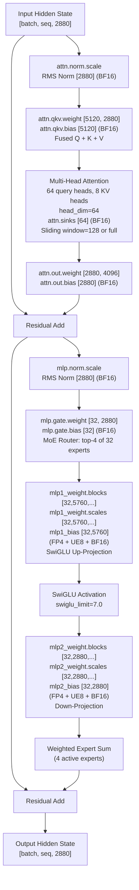

### Full Model Forward Pass

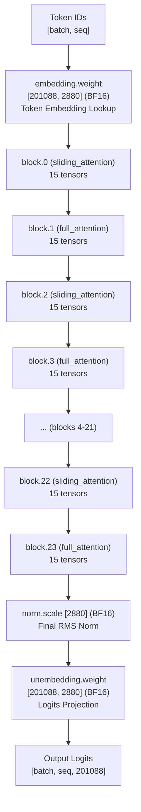

> **Note:** Layer types alternate: even = sliding_attention (window=128), odd = full_attention. Each block has 6 attention + 9 MoE tensors. RoPE: YaRN, theta=150000, factor=32. 24 total blocks = 360 per-block tensors + 3 global = 363 total.

### Dtype Distribution Summary

| Logical Dtype | Count | Description |
|---|---|---|
| BF16 | 267 | Attention weights, biases, norms, embeddings, router gates, MLP biases |
| FP4 | 48 | Packed 4-bit MoE expert weights (mlp1 and mlp2 blocks) |
| UE8 | 48 | Unsigned 8-bit quantization scales for FP4 expert weights |
| **Total** | **363** | |

### What is Inside vs Outside the Weights

| Inside model.safetensors | Outside model.safetensors |
|---|---|
| Embedding, attention, MoE, LM head tensors | `behavior/DeepThinkingFlow/system_prompt.txt` |
| Block tensor names, shapes, and dtypes | `skills/DeepThinkingFlow/SKILL.md` |
| Packed FP4 expert weights and BF16 biases | `behavior/DeepThinkingFlow/profile.json` |
| Final norm and vocab matrices | All Python scripts in `scripts/` |
| Nothing else | All training datasets and eval cases |
| Nothing else | LoRA config and adapter artifacts |
| Nothing else | Chat template and tokenizer JSON |

---

## Prerequisites

### System Requirements

| Item | Minimum | Recommended |
|---|---|---|
| Python | 3.10+ | 3.11+ |
| RAM | 16 GiB | 32 GiB+ |
| GPU VRAM | 16 GiB (QLoRA 4-bit) | 24 GiB+ (LoRA bf16) |
| Disk | 15 GiB (weights) | 30 GiB (weights + outputs) |

### Install Dependencies

**For inference (running the model):**
```bash
pip install -r requirements-transformers.txt
```

**For training (LoRA/QLoRA fine-tuning):**
```bash
python scripts/deepthinkingflow_cli.py bootstrap-training-env

# If using QLoRA (4-bit quantization):
pip install "bitsandbytes>=0.49.2,<1.0.0"
```

<details>
<summary>Dependency details</summary>

**Inference:**
| Package | Version |
|---|---|
| transformers | >=5.5.4, <6.0.0 |
| tokenizers | >=0.22.2, <1.0.0 |
| huggingface_hub | >=1.11.0, <2.0.0 |
| safetensors | >=0.7.0, <1.0.0 |
| jinja2 | >=3.1.6, <4.0.0 |

**Training (additional):**
| Package | Version |
|---|---|
| torch | >=2.11.0, <3.0.0 |
| accelerate | >=1.13.0, <2.0.0 |
| datasets | >=4.8.4, <5.0.0 |
| peft | >=0.19.1, <1.0.0 |

</details>

---

## Quick Start

### 1. Bootstrap the model directory from HuggingFace

```bash
# Download metadata (tokenizer, config, chat template) -- does NOT include weights
python scripts/deepthinkingflow_cli.py bootstrap

# Or include weights (~12.8 GiB):
python scripts/deepthinkingflow_cli.py bootstrap --include-weights
```

### 2. (Optional) Link local weights

If you already have `model.safetensors` in the `original/` directory:
```bash
python scripts/deepthinkingflow_cli.py assemble-model-dir
```

### 3. Inspect the local weight file

```bash
python scripts/deepthinkingflow_cli.py inspect-weights --path original/model.safetensors
```

## External Hosts

DeepThinkingFlow no longer ships its own frontend shell. The supported project surface is the Python CLI plus exported runtime assets.

### Claude Code

Use the repo directly inside Claude Code and call the Python entrypoints:

```bash
python scripts/deepthinkingflow_cli.py system-check
python scripts/deepthinkingflow_cli.py validate-bundle
python scripts/deepthinkingflow_cli.py chat
```

If you want a prebuilt runtime prompt payload for an external host:

```bash
python scripts/deepthinkingflow_cli.py export-runtime --target claude-code
```

This writes `system_prompt.txt`, `request.json`, and `request.txt` into `out/external-runtime/claude-code/`.

### Ollama

DeepThinkingFlow can export a runtime-only bridge for Ollama:

```bash
python scripts/deepthinkingflow_cli.py export-runtime \
  --target ollama \
  --ollama-model llama3.1:8b
```

This writes a `Modelfile` plus prompt assets into `out/external-runtime/ollama/`.

If you want the export step to fail immediately when Ollama is not installed:

```bash
python scripts/deepthinkingflow_cli.py export-runtime \
  --target ollama \
  --ollama-model llama3.1:8b \
  --fail-if-host-missing
```

Important:

- This is a **runtime-only** integration.
- It does **not** convert `model.safetensors` into an Ollama-native model by itself.
- Ollama still needs a valid base model tag such as `llama3.1:8b`, `qwen2.5:7b`, or another model already supported by your Ollama install.
- If you want to run the original DeepThinkingFlow weights directly in Ollama, you still need a separate conversion path to an Ollama-compatible format.

### Production Notes

- `export-runtime` is a bridge layer, not a training or merge step.
- `train_transformers_deepthinkingflow_lora.py` now hard-fails on duplicate target modules, invalid numeric knobs, missing resume checkpoints, and overlapping train/eval rows.
- External host compatibility is now explicit rather than implied: `runtime-only` claims stay outside weight-level claims.
- `preflight-all` gives one consolidated JSON snapshot over bundle health, runtime soft gates, training feasibility, dependency presence, and external-host readiness.
- `verify` is the shortest release-style local check because it combines bundle validation, project preflight, and the smoke suite.
- `release-manifest` turns verify/artifact state into a release-oriented JSON manifest.
- `.github/workflows/verify.yml` runs the core verification path automatically on push and pull request.

### 4. Interactive chat

```bash
python scripts/deepthinkingflow_cli.py chat
```

### 5. One-shot generation

```bash
python scripts/deepthinkingflow_cli.py run --user "Explain MoE architecture"
```

### 6. Validate the behavior bundle

```bash
python scripts/deepthinkingflow_cli.py validate-bundle behavior/DeepThinkingFlow
```

### 7. Run consolidated project preflight

```bash
python scripts/deepthinkingflow_cli.py preflight-all
```

### 8. Run consolidated verification

```bash
python scripts/deepthinkingflow_cli.py verify
```

### 9. Build a release manifest

```bash
python scripts/deepthinkingflow_cli.py release-manifest \
  --output out/release-manifest.json
```

### 10. Prepare combined training assets

```bash
python scripts/deepthinkingflow_cli.py prepare-training-assets
```

### 11. Report artifact hashes and claim level

```bash
python scripts/deepthinkingflow_cli.py report-artifacts \
  --base-weights original/model.safetensors \
  --adapter-dir out/DeepThinkingFlow-lora-reasoning-vi
```

---

## CLI Reference

All scripts are accessed through the unified CLI launcher:

```bash
python scripts/deepthinkingflow_cli.py <command> [args]
```

| Command | Script | Description |
|---|---|---|
| `chat` | `chat_deepthinkingflow.py` | Interactive multi-turn chat with conversation history |
| `run` | `run_transformers_deepthinkingflow.py` | One-shot generation returning JSON |
| `inspect-weights` | `inspect_safetensors_model.py` | Audit safetensors file without loading tensors into RAM |
| `render-prompt` | `render_transformers_deepthinkingflow_prompt.py` | Render the injected chat-template prompt |
| `compose-request` | `compose_behavior_request.py` | Compose messages from the behavior bundle |
| `validate-bundle` | `validate_behavior_bundle.py` | Validate bundle health including skill compliance |
| `bootstrap` | `bootstrap_transformers_deepthinkingflow.py` | Bootstrap model directory from HF |
| `bootstrap-training-env` | `bootstrap_training_env.py` | Install training deps into .venv-tools |
| `assemble-model-dir` | `assemble_local_transformers_model_dir.py` | Symlink local weights into model dir |
| `prepare-sft` | `prepare_harmony_sft_dataset.py` | Deduplicate + split base SFT dataset |
| `prepare-training-assets` | `prepare_deepthinkingflow_training_assets.py` | Build combined train/eval with skill compliance splits |
| `generate-skill-compliance` | `generate_skill_compliance_corpus.py` | Regenerate expanded skill-compliance dataset and eval corpus |
| `train-lora` | `train_transformers_deepthinkingflow_lora.py` | Train LoRA/QLoRA adapter with dry-run support |
| `preflight-all` | `preflight_deepthinkingflow_project.py` | Consolidated preflight across bundle, runtime, training, and external hosts |
| `verify` | `verify_deepthinkingflow_project.py` | Consolidated verification across bundle validation, preflight, and smoke tests |
| `release-manifest` | `build_release_manifest.py` | Release-oriented manifest combining verify and artifact state |
| `eval` | `evaluate_reasoning_outputs.py` | Score outputs against trait + rubric checklist |
| `report-artifacts` | `report_deepthinkingflow_artifacts.py` | Hash artifacts and classify claim level |

### Chat Commands (inside a chat session)

```
/help                Show available commands
/status              Show current runtime settings
/clear               Clear history, keep system prompt
/history             Print the retained conversation
/analysis on|off     Toggle visible analysis output
/reasoning <level>   Switch reasoning effort: low, medium, high
/quit                Exit the chat session
```

---

## Workflows

### 1. Inference Workflow

> Use an existing model to generate answers.

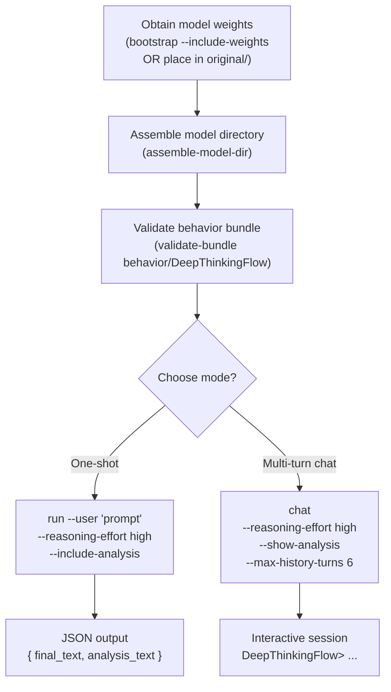

**Detailed steps:**

```bash
# Step 1: Prepare model
python scripts/deepthinkingflow_cli.py bootstrap
python scripts/deepthinkingflow_cli.py assemble-model-dir

# Step 2: Validate bundle
python scripts/deepthinkingflow_cli.py validate-bundle behavior/DeepThinkingFlow

# Step 3a: One-shot
python scripts/deepthinkingflow_cli.py run \
  --user "Analyze this prompt" \
  --reasoning-effort high \
  --include-analysis

# Step 3b: Chat
python scripts/deepthinkingflow_cli.py chat \
  --reasoning-effort high \
  --show-analysis \
  --max-history-turns 6
```

---

### 2. Training Workflow

> Train a LoRA/QLoRA adapter to improve model behavior.

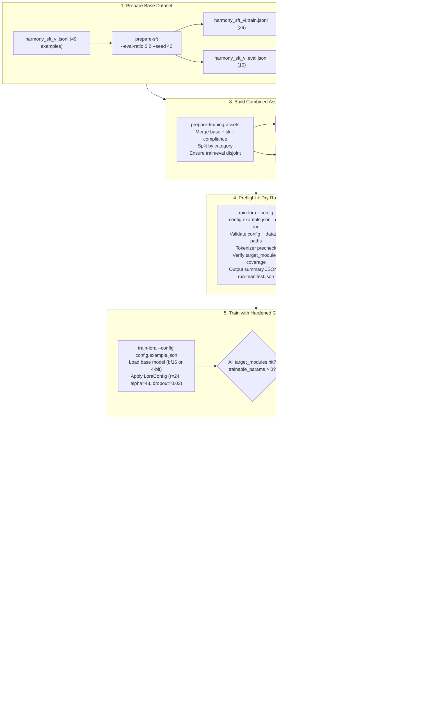

**Detailed steps:**

```bash
# Step 1: Prepare base dataset (if fixed splits do not exist yet)
python scripts/deepthinkingflow_cli.py prepare-sft \
  --input behavior/DeepThinkingFlow/training/harmony_sft_vi.jsonl \
  --train-out behavior/DeepThinkingFlow/training/harmony_sft_vi.train.jsonl \
  --eval-out behavior/DeepThinkingFlow/training/harmony_sft_vi.eval.jsonl \
  --eval-ratio 0.2 --seed 42

# Step 2: Build combined training assets (base + skill compliance)
python scripts/deepthinkingflow_cli.py prepare-training-assets

# Step 3: Dry run
python scripts/deepthinkingflow_cli.py train-lora \
  --config training/DeepThinkingFlow-lora/config.example.json \
  --dry-run

# Step 4: Train (LoRA)
python scripts/deepthinkingflow_cli.py train-lora \
  --config training/DeepThinkingFlow-lora/config.example.json

# Or Train (QLoRA -- saves VRAM)
python scripts/deepthinkingflow_cli.py train-lora \
  --config training/DeepThinkingFlow-lora/config.qlora.example.json

# Step 5: Evaluate
python scripts/deepthinkingflow_cli.py eval \
  --eval-cases behavior/DeepThinkingFlow/evals/reasoning_following.jsonl \
  --predictions your_predictions.jsonl

# Step 6: Report artifacts
python scripts/deepthinkingflow_cli.py report-artifacts \
  --base-weights original/model.safetensors \
  --adapter-dir out/DeepThinkingFlow-lora-reasoning-vi
```

---

### 3. Evaluation Workflow

> Score output quality along two dimensions: **traits** and **rubrics**.

```mermaid
flowchart TD
    A["eval_cases.jsonl<br/>Each case has: id, user,<br/>expected_traits,<br/>required_keywords, rubric rules"]
    B["predictions.jsonl<br/>Each row has:<br/>id, final_text, analysis_text"]

    A --> C
    B --> C

    subgraph Traits["Trait Scoring (22 trait types)"]
        C["Evaluate Traits"]
        C --> T1["simple_definition -- first line < 180 chars"]
        C --> T2["short_analysis -- analysis < 400 chars"]
        C --> T3["one_concrete_example -- contains example/vi du"]
        C --> T4["concise_reasoning -- output < 1400 chars"]
        C --> T5["likely_causes_first -- lists probable causes"]
        C --> T6["ordered_checks -- contains numbered steps"]
        C --> T7["probable_fix -- contains fix/solution"]
        C --> T8["findings_first -- first line leads with findings"]
        C --> T9["security_risk_called_out -- mentions security"]
        C --> T10["recommendation_first -- first line recommends"]
        C --> T11["3_to_5_criteria -- at least 3 comparison criteria"]
        C --> T12["one_tradeoff -- mentions a tradeoff"]
        C --> T13["phased_plan -- contains phase 1/2"]
        C --> T14["validation_step -- includes validation"]
        C --> T15["rollback_step -- includes rollback/fallback"]
        C --> T16["main_risk -- identifies the main risk"]
        C --> T17["brief_summary -- output < 1600 chars"]
        C --> T18["scenario_example -- contains scenario"]
        C --> T19["explicit_runtime_only_boundary"]
        C --> T20["explicit_training_boundary"]
        C --> T21["explicit_no_weight_claim"]
        C --> T22["analysis_sanitized -- no internal markers"]
    end

    subgraph Rubrics["Rubric Scoring"]
        D["Evaluate Rubrics"]
        D --> R1["required_keywords -- all must appear"]
        D --> R2["required_keyword_groups -- at least one per group"]
        D --> R3["forbidden_keywords -- none must appear"]
        D --> R4["must_start_with_one_of -- first line prefix"]
        D --> R5["max_chars -- length limit"]
        D --> R6["analysis_max_chars -- analysis length limit"]
        D --> R7["min_numbered_steps -- minimum step count"]
    end

    T1 & T2 & T3 & T4 & T5 & T6 & T7 & T8 & T9 & T10 & T11 & T12 & T13 & T14 & T15 & T16 & T17 & T18 & T19 & T20 & T21 & T22 --> E
    R1 & R2 & R3 & R4 & R5 & R6 & R7 --> E

    E["Output Summary JSON<br/>{<br/>  trait_pass_rate: 0.85,<br/>  rubric_pass_rate: 0.90,<br/>  results: [...]<br/>}"]
```

---

### 4. Full Pipeline (End-to-End)

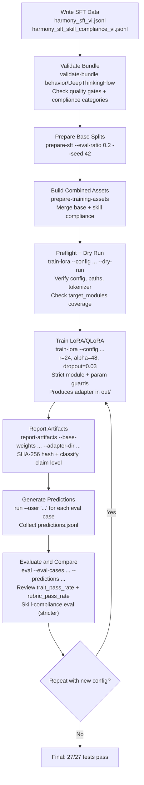

---

## Behavior Bundle System

A behavior bundle is the central mechanism for **steering model behavior without modifying weights**.

### Bundle Structure

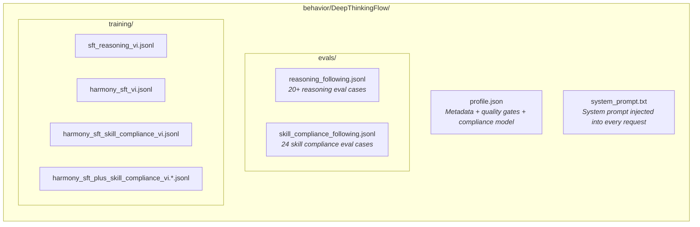

### Compliance Model

The bundle enforces a strict compliance ladder:

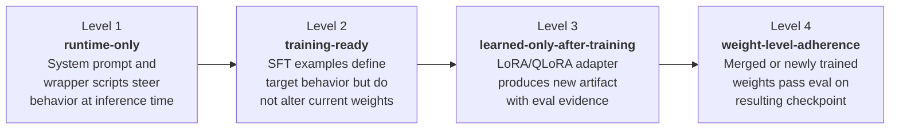

```json
{
  "guarantees": {
    "does_not_modify_weights": true,
    "does_not_claim_model_retraining": true,
    "requires_runtime_integration": true
  }
}
```

### System Prompt Structure

The system prompt uses tagged blocks:

| Block | Purpose |
|---|---|
| `<identity>` | Assistant identity declaration |
| `<hard_rules>` | Mandatory rules (language, transparency, verification, no false weight claims) |
| `<task_classifier>` | Classifies tasks: explain, debug, review, compare, plan, estimate |
| `<depth_policy>` | Three levels: Quick, Standard, Deep |
| `<output_policy>` | Output format per task type |
| `<local_model_guidance>` | Optimization guidance for local models |
| `<quality_bar>` | Quality standards |

### Quality Gates

The bundle is automatically validated via `validate-bundle`:

| Gate | Value |
|---|---|
| `min_sft_examples` | >= 6 |
| `min_harmony_sft_examples` | >= 45 |
| `min_skill_compliance_examples` | >= 48 |
| `min_eval_cases` | >= 20 |
| `min_skill_compliance_eval_cases` | >= 24 |
| `require_unique_eval_ids` | `true` |
| `require_unique_skill_compliance_eval_ids` | `true` |
| `require_unique_harmony_examples` | `true` |
| `require_unique_skill_compliance_examples` | `true` |
| `require_skill_compliance_examples` | `true` |
| `min_examples_per_skill_compliance_category` | >= 12 |

### Required Skill Compliance Categories

| Category | Purpose |
|---|---|
| `reject-false-weight-claim` | Model must refuse claims that SKILL.md or prompts changed weights |
| `runtime-vs-learned` | Model must distinguish runtime steering from learned behavior |
| `short-analysis-no-cot` | Model must keep analysis short without claiming hidden chain-of-thought |
| `deep-style-without-fake-internals` | Model must produce deep answers without fabricating proprietary internals |

---

## Model Profile

| Property | Value |
|---|---|
| **Identity** | DeepThinkingFlow-AI (independent AI system) |
| **Architecture** | Transformer + Mixture-of-Experts (runtime class: GptOssForCausalLM) |
| **Layers** | 24 (alternating sliding_attention / full_attention) |
| **Hidden size** | 2,880 |
| **Intermediate size** | 2,880 |
| **Vocab size** | 201,088 |
| **Attention** | 64 query heads, 8 KV heads, head_dim=64, with attention sinks |
| **Experts** | 32 per layer, 4 active per token |
| **Context** | 4,096 tokens initial, max 131,072 with YaRN scaling |
| **Sliding window** | 128 tokens (even-numbered layers) |
| **RoPE** | YaRN type, theta=150000, factor=32 |
| **Activation** | SiLU (SwiGLU with swiglu_limit=7.0) |
| **Quantization** | MXFP4 (attention/embedding excluded) |
| **Total params (est.)** | ~21.5B (when expanding packed FP4) |
| **Active params/token (est.)** | ~4.19B (4 of 32 experts) |
| **Weight format** | BF16 (attention/embedding) + Packed FP4 + UE8 scales (MoE) |
| **File size** | ~12.82 GiB (13,761,300,984 bytes) |
| **Total tensors** | 363 |

### Special Tokens and Channel System

The model uses a channel system to separate reasoning from output:

```
<|start|>assistant<|channel|>analysis<|message|>...<|end|>
<|start|>assistant<|channel|>final<|message|>...<|return|>
```

- **`analysis`** -- Visible reasoning (hidden by default; enable via `--show-analysis` or `/analysis on`)
- **`final`** -- The final answer shown to the user

### Generation Config

| Parameter | Value |
|---|---|
| `bos_token_id` | 199998 |
| `eos_token_id` | [200002, 199999, 200012] |
| `pad_token_id` | 199999 |
| `do_sample` | true |

---

## Training Configuration

### LoRA Config (Final Trained Values)

| Parameter | Value | Description |
|---|---|---|
| `lora_r` | 24 | Rank of LoRA matrices (evolved from 4 through 4 milestones) |
| `lora_alpha` | 48 | Scaling factor (evolved from 8) |
| `lora_dropout` | 0.03 | Dropout rate (reduced from 0.05) |
| `target_modules` | `[q_proj, k_proj, v_proj, o_proj]` | Attention projection layers |
| `bf16` | `true` | BFloat16 precision |
| `learning_rate` | 0.0002 | Peak learning rate |
| `lr_scheduler_type` | `cosine` | Cosine decay scheduler |
| `gradient_checkpointing` | `true` | Saves VRAM |
| `gradient_accumulation_steps` | 8 | Effective batch = 1 x 8 = 8 |
| `max_seq_length` | 4,096 | Maximum sequence length |
| `early_stopping_patience` | 3 | Stop if eval_loss does not improve for 3 consecutive evals |
| `optim` | `adamw_torch` | Optimizer |
| `attn_implementation` | `eager` | Attention backend |
| `dataset_path` | Combined train split | Base + skill compliance examples |
| `eval_dataset_path` | Combined eval split | Base + skill compliance eval |

### QLoRA Config (`config.qlora.example.json`)

Same as LoRA, with these additions:

| Parameter | Value | Description |
|---|---|---|
| `use_qlora` | `true` | Enables QLoRA mode |
| `load_in_4bit` | `true` | Loads model in 4-bit (NF4) |
| `optim` | `paged_adamw_8bit` | Memory-efficient optimizer |

> **Note:** QLoRA requires the `bitsandbytes` package.

---

## Training Parameter Evolution

DeepThinkingFlow underwent 4 progressive iterations of adapter parameter scaling, increasing trainable parameters from baseline to 6x the original count. All iterations completed successfully with passing training runs, artifact report verification, and the full test suite (27/27).

### Evolution Summary

| Milestone | lora_r | lora_alpha | lora_dropout | Epochs | Learning Rate | Train Samples | Eval Samples | Trainable Params | Train Loss | Eval Loss |
|---|---|---|---|---|---|---|---|---|---|---|
| Baseline | 4 | 8 | 0.05 | 1 | 0.0005 | 8 | 4 | 6,656 | 12.2351 | 12.2371 |
| Reform 1 | 8 | 16 | 0.05 | 2 | 0.00035 | 12 | 6 | 13,312 | 12.2199 | 12.2248 |
| Reform 2 | 16 | 32 | 0.05 | 3 | 0.00025 | 16 | 8 | 26,624 | 12.1929 | 12.1814 |
| Reform 3 (Final) | 24 | 48 | 0.03 | 3 | 0.00025 | 16 | 8 | 39,936 | 12.1677 | 12.1403 |

### Parameter Growth Trajectory

| Milestone | Trainable Params | Delta | Multiplier vs Baseline |
|---|---|---|---|
| Baseline | 6,656 | -- | 1x |
| Reform 1 | 13,312 | +6,656 | 2x |
| Reform 2 | 26,624 | +13,312 | 4x |
| Reform 3 (Final) | 39,936 | +13,312 | 6x |

**Total growth:** 6,656 to 39,936 (+33,280 parameters, 6x baseline)

### Consistent Metrics Across All Milestones

| Metric | Value |
|---|---|
| `total_params` | ~52.36M -- 52.39M |
| `trainable_ratio` | 0.000127 to 0.000762 |
| `lora_target_total_matches` | 8 |
| `lora_missing_targets` | [] (none) |
| Training run | Completed successfully |
| Artifact report | Pass |
| Test suite | 27/27 pass |

### Parameter Evolution Workflow

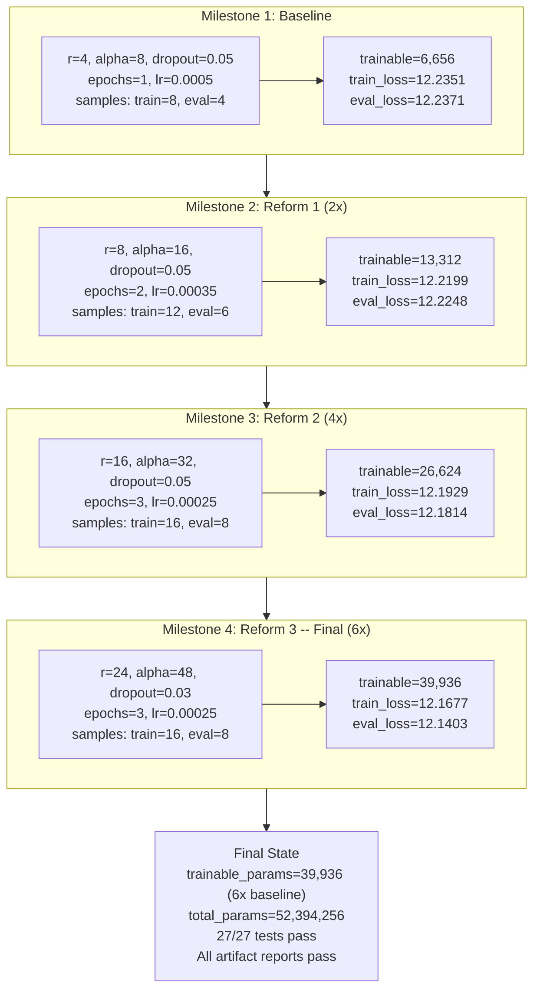

### Loss Progression

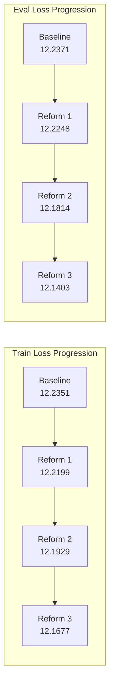

### Detailed Milestone Breakdown

#### Milestone 1: Baseline

Initial adapter configuration establishing the starting point.

| Parameter | Value |
|---|---|
| `lora_r` | 4 |
| `lora_alpha` | 8 |
| `lora_dropout` | 0.05 |
| `num_train_epochs` | 1 |
| `max_train_samples` | 8 |
| `max_eval_samples` | 4 |
| `trainable_params` | 6,656 |
| `total_params` | 52,360,976 |
| `trainable_ratio` | 0.00012712 |
| `train_loss` | 12.2351 |
| `eval_loss` | 12.2371 |

Result: Training run completed, artifact report pass, 27 tests pass.

#### Milestone 2: Reform 1 (2x Baseline)

First parameter scaling -- doubled LoRA rank and alpha, increased training data and epochs.

| Change | Before | After |
|---|---|---|
| `lora_r` | 4 | 8 |
| `lora_alpha` | 8 | 16 |
| `num_train_epochs` | 1 | 2 |
| `learning_rate` | 0.0005 | 0.00035 |
| `max_train_samples` | 8 | 12 |
| `max_eval_samples` | 4 | 6 |

| Metric | Value |
|---|---|
| `trainable_params` | 13,312 |
| `total_params` | 52,367,632 |
| `trainable_ratio` | 0.0002542 |
| `train_loss` | 12.2199 |
| `eval_loss` | 12.2248 |

Result: Training run completed, artifact report pass, 27 tests pass.

#### Milestone 3: Reform 2 (4x Baseline)

Second parameter scaling -- doubled rank and alpha again, increased epochs and training data.

| Change | Before | After |
|---|---|---|
| `lora_r` | 8 | 16 |
| `lora_alpha` | 16 | 32 |
| `num_train_epochs` | 2 | 3 |
| `learning_rate` | 0.00035 | 0.00025 |
| `max_train_samples` | 12 | 16 |
| `max_eval_samples` | 6 | 8 |

| Metric | Value |
|---|---|
| `trainable_params` | 26,624 |
| `total_params` | 52,380,944 |
| `trainable_ratio` | 0.00050828 |
| `train_loss` | 12.1929 |
| `eval_loss` | 12.1814 |

Result: Training run completed, artifact report pass, 27 tests pass.

#### Milestone 4: Reform 3 -- Final Configuration (6x Baseline)

Final parameter scaling -- increased rank to 24, alpha to 48, reduced dropout to 0.03.

| Change | Before | After |
|---|---|---|
| `lora_r` | 16 | 24 |
| `lora_alpha` | 32 | 48 |
| `lora_dropout` | 0.05 | 0.03 |

Epochs, train samples, and eval samples were held constant from Reform 2.

| Metric | Value |
|---|---|
| `trainable_params` | 39,936 |
| `total_params` | 52,394,256 |
| `trainable_ratio` | 0.00076222 |
| `train_loss` | 12.1677 |
| `eval_loss` | 12.1403 |

Result: Training run completed, artifact report pass, 27 tests pass.

### Additional Hardening Measures

Beyond parameter scaling, the following improvements were applied throughout the evolution:

| Measure | Description |
|---|---|
| Strict `target_modules` validation | Fails if any target module is not matched |
| Zero trainable params guard | Aborts if `trainable_params = 0` |
| Artifact report hashing | SHA-256 hashes for base weights, adapter outputs, and eval files |
| Preflight checks | Validates config, dataset paths, and tokenizer before training |
| Compiled runtime pack | Optimized runtime bundle for deployment |
| Skill-compliance eval tightening | Stricter evaluation criteria for compliance |
| Full retraining per milestone | Complete retraining after each configuration change |

---

## Testing

### Smoke Tests (27/27)

```bash
python -m pytest tests/test_deepthinkingflow_smoke.py -v
```

| Test Class | Test | Description |
|---|---|---|
| `RuntimeHelpersTest` | `test_extracts_analysis_and_final_text` | Verifies channel token extraction for analysis and final |
| `RuntimeHelpersTest` | `test_sanitizes_visible_analysis_and_strips_channel_lines` | Strips internal channel markers from visible analysis |
| `RuntimeHelpersTest` | `test_truncates_long_visible_analysis` | Truncates analysis to 700 char max |
| `CliSmokeTest` | `test_help_dispatches_to_subcommand_help` | CLI `help` routing |
| `CliSmokeTest` | `test_unknown_command_returns_error` | CLI unknown command returns exit code 2 |
| `CliSmokeTest` | `test_dispatch_builds_expected_subprocess_call` | CLI subprocess argument construction |
| `CliSmokeTest` | `test_inspect_weights_command_is_registered` | Inspect-weights command exists in CLI |
| `CliSmokeTest` | `test_prepare_training_assets_command_is_registered` | Prepare-training-assets command exists |
| `CliSmokeTest` | `test_generate_skill_compliance_command_is_registered` | Generate-skill-compliance command exists |
| `CliSmokeTest` | `test_report_artifacts_command_is_registered` | Report-artifacts command exists |
| `CliSmokeTest` | `test_bootstrap_training_env_command_is_registered` | Bootstrap-training-env command exists |
| `RenderPromptSmokeTest` | `test_render_prompt_main_with_fake_tokenizer` | Prompt rendering pipeline |
| `RunSmokeTest` | `test_run_main_returns_expected_json_without_loading_real_model` | One-shot generation flow |
| `ChatSmokeTest` | `test_chat_main_handles_commands_and_response_flow` | Full chat lifecycle with commands |
| `BundleValidationSmokeTest` | `test_validate_bundle_reports_skill_compliance_examples` | Bundle validation with skill compliance gates |
| `EvaluatorSmokeTest` | `test_scores_new_skill_compliance_traits` | Skill compliance trait scoring |
| `EvaluatorSmokeTest` | `test_analysis_sanitized_trait_rejects_internal_markers` | Rejects leaked internal markers in analysis |
| `TrainDryRunSmokeTest` | `test_dry_run_succeeds_without_transformers` | Training dry-run without GPU |
| `TrainDryRunSmokeTest` | `test_target_module_coverage_helpers_detect_missing_targets` | LoRA target module coverage detection |
| `TrainingAssetBuilderTest` | `test_builder_creates_disjoint_fixed_splits` | Asset builder produces non-overlapping splits |
| `SafetensorsInspectorTest` | `test_inspector_reports_raw_checkpoint_and_config_match` | Inspector validates tensor shapes against config |
| `ArtifactReportSmokeTest` | `test_artifact_report_classifies_claim_level` | Artifact report claim level classification |
| `EnvHelpersTest` | `test_dependency_status_detects_transformers` | Environment dependency detection |

> Tests use mocks and run without a GPU or real model weights.

---

## Codex Skill Integration

The `skills/DeepThinkingFlow/` directory provides guidance for AI coding assistants (Codex, etc.):

```
skills/DeepThinkingFlow/
├── SKILL.md                          # Main skill instructions
├── agents/
│   └── openai.yaml                   # Agent interface config
└── references/
    ├── model-profile.md              # Architecture and prompting implications
    ├── reasoning-patterns.md         # Reasoning behavior patterns
    ├── prompt-templates.md           # Reusable prompt scaffolds
    ├── response-examples.md          # Answer templates
    ├── runtime-and-training.md       # Runtime and training integration guide
    └── skill-compliance.md           # Compliance ladder documentation
```

### Skill Workflow

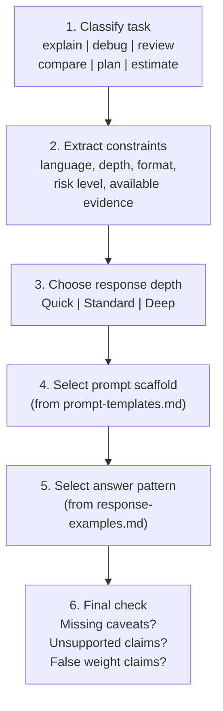

### Output Contract

```
Goal:        <one-sentence restatement>
Assumptions: <only if needed>
Analysis:    <short visible reasoning>
Answer:      <direct answer or recommendation>
Examples:    <1-3 concrete examples>
Checks:      <verification, caveat, or next step>
```

---

## Dataset Statistics

| Dataset | Count | Description |
|---|---|---|
| `sft_reasoning_vi.jsonl` | 6+ examples | Original SFT seed (Vietnamese) |
| `harmony_sft_vi.jsonl` | 49 examples | Full base harmony-format dataset |
| `harmony_sft_vi.train.jsonl` | 39 examples | Fixed base train split (seed=42) |
| `harmony_sft_vi.eval.jsonl` | 10 examples | Fixed base eval split (seed=42) |
| `harmony_sft_skill_compliance_vi.jsonl` | 48+ examples | Skill compliance (4 categories, 12 each) |
| `harmony_sft_skill_compliance_vi.train.jsonl` | train split | Skill compliance train split |
| `harmony_sft_skill_compliance_vi.eval.jsonl` | eval split | Skill compliance eval split |
| `harmony_sft_plus_skill_compliance_vi.jsonl` | combined | Combined full dataset (base + skill) |
| `harmony_sft_plus_skill_compliance_vi.train.jsonl` | train split | Combined train split |
| `harmony_sft_plus_skill_compliance_vi.eval.jsonl` | eval split | Combined eval split |
| `reasoning_following.jsonl` | 20+ cases | Reasoning eval cases with traits + rubric |
| `skill_compliance_following.jsonl` | 24 cases | Skill compliance eval cases |

---

## Design Principles

1. **Transparency** -- No claims of hidden chain-of-thought or secret reasoning. No false weight claims.
2. **Honest Compliance Boundaries** -- Explicit separation of runtime-only, training-ready, and learned-only-after-training.
3. **Separation of Concerns** -- Behavior bundle is decoupled from model weights. SKILL.md does not modify safetensors.
4. **Reproducibility** -- Fixed train/eval splits, deterministic seeds, disjoint combined datasets.
5. **Safety** -- Low-memory warnings, config validation, dry-run mode, bundle health checks.
6. **Bilingual** -- Vietnamese-first, English-compatible.
7. **Modularity** -- Each script does one thing; the CLI orchestrates everything.
8. **Verifiability** -- The safetensors inspector can audit the weight file header-only without loading tensors into RAM. The artifact reporter hashes and classifies claim levels.

---

## License

This project is released under the [GNU General Public License v3.0](LICENSE).

---

<p align="center">
  <strong>DeepThinkingFlow-AI</strong> -- by <a href="https://github.com/danggiaminh">Dang Gia Minh</a><br/>
  <sub>Runtime steering | Bilingual reasoning | Adapter-based fine-tuning | Skill compliance | Open source</sub>
</p>
